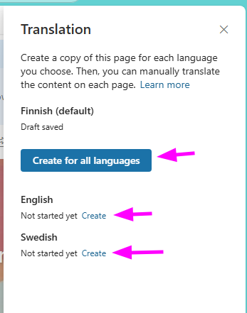

# SharePoint Online Page Translation Flows

<!-- toc -->

- [Usage](#usage)
- [Installation](#installation)
- [Entra ID, App registration](#entra-id-app-registration)
- [SharePoint Online](#sharepoint-online)
  * [Power Automate Account settings](#power-automate-account-settings)
  * [Application permissions to site if using sites.selected permissions](#application-permissions-to-site-if-using-sitesselected-permissions)
- [Power Automate Solution](#power-automate-solution)
- [Solution overview](#solution-overview)
  * [Environmental variables](#environmental-variables)
  * [Connections](#connections)
- [Power Automate Flow Documentation](#power-automate-flow-documentation)
  * [Parent flow - Start translation](#parent-flow---start-translation)
    + [Trigger](#trigger)
      - [Trigger condition expressions](#trigger-condition-expressions)
    + [Actions](#actions)
    + [Connections used](#connections-used)
  * [Child flow - Automatic Page Translation](#child-flow---automatic-page-translation)
    + [Trigger](#trigger-1)
    + [Key Parameters](#key-parameters)
    + [Main Steps](#main-steps)
    + [Connections Used](#connections-used)
    + [Error Handling](#error-handling)
    + [Notes](#notes)
    + [Adaptive card JSON](#adaptive-card-json)

<!-- tocstop -->

Automatic SharePoint online page translation feature which allows users to create page translations from Finnish/English/Swedish to Finnish/English/Swedish depending on site language settings.

Automation is built by using Power Automate Flow and [Microsoft Translator](https://learn.microsoft.com/en-us/connectors/translatorv2).  (Translation limit with free is 55 000 characters per day).

##  Usage

1. Create a new SharePoint Page.
2. Add your content to the page.
3. Save the page as draft (or publish the page).
4. From the page top suite link bar select "Translation"
5. Select Create on the language you want to translate to. You can also select "Create for all languages".



6. Automation will start and notify you via teams message when translation is done (3000 characters takes around 1 minute to process)
7. Go to translated page, review it and publish it.

## Installation

Requirements:
- App registration for power automate flow
- Power automate account with Power Automate Premium license
- Sites with additional languages enabled (Currently supports finnish, english, swedish)

## Entra ID, App registration

To enable the flow to read and write SharePoint pages, authorization to the Microsoft Graph API is required.
**Required permission:** `Sites.ReadWrite.All` or if you want to be more restrictive select `Sites.Selected`

Navigagte to https://entra.microsoft.com/ -> Applications -> App Registration
1. Create a new app registration
2. Name the app, for example "**SharePoint online page translation flow**"
	- Select: **Accounts in this organizational directory only (Single tenant)**
	- No need to set Redirect URI
3. Open the app you just created
4. Go to **API Permissions**
5. Remove existing permissions
6. Add a permission
	1. Choose **Microsoft Graph**
	2. Choose **Application permission**
	3. Search for and select `Sites.ReadWrite.All`(or `Sites.Selected`)
	4. Click **Add permissions**
7. Click **Grant admin consent** 
8. Go to Certificates & Secrets
9. Create a client secret
	1. Give it a name, for example **Power Automate Translation Flow**
	2. Select expires date, for example **720 days**
10. Copy the **secret value** and save it for later use
11. Go to **Overview**
12. Copy **Application (client) ID** and save it for later use
13. Copy **Directory (tenant) ID** and save it for later use

You now have an application with the necessary permissions, along with the **Client ID**, **Client Secret**, and **Tenant ID**. This information will be used when importing the Power Automate solution.

## SharePoint Online

### Power Automate Account settings
1. Go to the site where you want to install page translation automation
2. Add your power automate account to site permissions as member
3. Make sure you have added site languages to your site(Site settings --> Site Languages) 
4. Navigate to Site Pages library
5. Go to library settings 
6. Get the library GUID and save it for later use
	- GUID can be found from URL, for example `/_layouts/15/listedit.aspx?List=%7B796ce85d-28cc-4fb0-b9ef-7183ecbc08b7%7D` The guid is in between of `%7B` and `%7D` so in this example it would be `796ce85d-28cc-4fb0-b9ef-7183ecbc08b7`
7. Get the site address for later use

Now you should have sharepoint configurations done for one site and you should have following information saved:
- Site Address
- Site Pages GUID

Repeat the steps for each site you want to enable the page translation feature.

### Application permissions to site if using sites.selected permissions
Get site ID

1. In browsers access URL (Replace YOURTENANT and YOURSITE with your SPO site) `https://YOURTENANT.sharepoint.com/sites/YOURSITE/_api/site/id`
2. Use ID value to create Post request to set site permissions for App (replace YOURSITEID with the id):

Use for example Graph explorer https://developer.microsoft.com/en-us/graph/graph-explorer  

Set read permissions:  
**POST** request to **URI**: `https://graph.microsoft.com/v1.0/sites/YOURSITEID/permissions`  

Body:  
```json
{ 
 "roles": ["read"],
 "grantedToIdentities": [{
    "application": {
      "id": "YOUR APPLICATION ID",  //Target Application’s Client Id
      "displayName": "YOUR APPLICATION DISPLAY NAME"       //Target Application’s Display name
    }
  }]
}
```

Set write permissions:  
**POST** request to **URI**: `https://graph.microsoft.com/v1.0/sites/YOURSITEID/permissions`  

Body:  
```json
{ 
 "roles": ["write"],
 "grantedToIdentities": [{
    "application": {
      "id": "YOUR APPLICATION ID",  //Target Application’s Client Id
      "displayName": "YOUR APPLICATION DISPLAY NAME"       //Target Application’s Display name
    }
  }]
}
```

> [!TIP]
> Repeat the steps if you if you have more than one site.


## Power Automate Solution
1. Navigate to https://make.powerautomate.com/ with your power automate account
2. Select target environment
3. Go to Solutions
4. Import a solution
5. During import authorize connections:
	- **Microsoft Teams**
	- **SharePoint**
	- **Microsoft Translator**
6. During import configure following environment variables
	- **AutomationAccountEmail**
	- **ClientID**
	- **ClientSecret**
	- **TenantID**
    - **InitialSiteID**
    - **InitialSitePagesID**

7. After the import go to **Parent Flow - Start translation** flow and rename flow from **Parent flow - Start translation** to **Parent flow - Start translation - siteName**
8. Modify Child flow - Automatic page translations section
	- Modify **Compose AdaptiveCard Message** from bottom of the flow if needed. This is the message teams card will show
	- Modify **Post card in chat or channel** from bottom of the flow if needed. This contains teams message title: "`SharePoint sivu on käännetty!`"

> [!IMPORTANT] 
> If you have multiple sites
> For each site create a new flow (copy of Parent flow - Start translation) and modify Site Address & GUID to match the site in question.


## Solution overview

### Environmental variables
- **ClientID, ClientSecret, TenantID, Audience**: Used for authenticating with Microsoft Graph API.
- **AI-Information-Text**: The notice text added to each translated page.
- **AutomationAccountEmail**: Email address of the automation which is calling child flow
- **InitialSiteUrl**: The initial site URL where you want connect page translations
- **InitialSitePagesID**: The initial site Pages ID where you want to connect page translations
### Connections
- **SharePoint Online**: For retrieving and updating page content.
- **Microsoft Translator**: For translating text.
- **Microsoft Teams**: For sending Teams adaptive card notifications.


## Power Automate Flow Documentation
### Parent flow - Start translation
This flow monitors a SharePoint site for newly created items in specific language folders and triggers a child flow to handle translation tasks when certain conditions are met.
#### Trigger
**Type:** `OpenApiConnection` 
**Event:** `When an item is created`
- **Recurrence:** Every 1 minute
- **SharePoint Site:** `https://YOURTENANT.sharepoint.com/sites/YOURSITE`
- **Target Library/Table ID:** `YourSitePagesLibraryID`
- **Conditions:**
    - The item path must be one of:
        - `SitePages/en/`
        - `SitePages/sv/`
        - `SitePages/fi/`
    - The item version number must be `0.1`

##### Trigger condition expressions
```
@or(equals(triggerBody()?['{Path}'], 'SitePages/en/'), equals(triggerBody()?['{Path}'], 'SitePages/sv/'), equals(triggerBody()?['{Path}'], 'SitePages/fi/'))
@equals(triggerBody()?['{VersionNumber}'],'0.1')
```

#### Actions

1. **Compose**
	- **Purpose:** Logs and evaluates trigger conditions.
	- **Details Captured:**
	    - Version number
	    - Path
	    - Boolean results for:
	        - Path being in a translation folder
	        - Version being `0.1`
```
Version number value: @{triggerBody()?['{VersionNumber}']}
Path: @{triggerBody()?['{Path}']}

Individual trigger condition results:
Path leads to translation folder: @{or(equals(triggerBody()?['{Path}'],'SitePages/fi/'),equals(triggerBody()?['{Path}'],'SitePages/en/'),equals(triggerBody()?['{Path}'],'SitePages/sv/'))}
Is version 0.1: @{equals(triggerBody()?['{VersionNumber}'],'0.1')}

Trigger condition:
is news and in translate section?
@{or(
    equals(triggerBody()?['{Path}'], 'SitePages/fi/'), equals(triggerBody()?['{Path}'], 'SitePages/en/'),
    equals(triggerBody()?['{Path}'], 'SitePages/sv/')
    )}

Is version 0.1?
@{equals(triggerBody()?['{VersionNumber}'],'0.1')}
```
 2. **Run a Child Flow**
	- **Type:** `Workflow`
	- **Triggered After:** Compose action succeeds
	- **Child Flow Reference ID:** `0c9a29ba-b847-f011-8779-7c1e52500fd6`
	- **Inputs Passed to Child Flow:**
	    - `Link`: From the created item
	    - `createdBy`: Author's email
	    - `sharepointPageID`: ID of the SharePoint page
	    - `PagesLibraryGUID`: `YourSitePagesLibraryID`
#### Connections used
- **Service:** SharePoint Online
- **Connection Logical Name:** `apa_sharedsharepointonline_492b8`
---
### Child flow - Automatic Page Translation
This flow automates the translation of SharePoint site pages into a target language using Microsoft Translator and updates the page content, web parts, and title accordingly. It also notifies the user via Microsoft Teams when the translation is complete.
#### Trigger
- **Manual HTTP Request Trigger**  
    The flow is initiated by an HTTP POST request, typically from another flow or application. Only authorized users specified in `AutomationAccountEmail` environmental variable can trigger it.
- **HTTP POST request contains**:
    - `Link`: URL to the SharePoint page
    - `createdBy`: User to notify
    - `sharepointPageID`: ID of the SharePoint page
    - `PagesLibraryGUID`: GUID of the SharePoint Pages library
#### Key Parameters
- **ClientID, ClientSecret, TenantID, Audience**: Used for authenticating with Microsoft Graph API.
- **AI-Information-Text**: Notice text added to every translated page.
- **Target Language**: Provided in the request or determined from the page metadata.
#### Main Steps
1. **Initialize Variables**
    - `SiteUrl` = Target site
    - `LanguagesArray` = Accepted values for translation API
    - `targetLanguage` = Target language short code, for example "`en`" 
    - `targetLanguageName` = Target language display name, for example "`English`"
    - `pageTitle` = Processed page title
    - `OldWebparts` = Original text webparts
    - `NewWebparts` = Translated text webpart
    - `OldStandardWebparts` = Original standard text webparts
    - `NewStandardWebparts` = Translated standard text webpart 
    - `at` = @ sign for making HTTP request development easier
2.  **Get SharePoint Site ID** (Send an HTTP request to SharePoint)
    - Sends an HTTP request to SharePoint to get the site ID.
    - URI: `_api/site/id`
    - Method: `GET`
3. **Get SharePoint Page Properties** (Get file properties)
    - Retrieves file properties and metadata for the specified SharePoint page.
4. **Get Page Content and Structure** (Send an HTTP request to SharePoint)
    - Fetches the page content and parses the JSON to extract details.
    - URI: `_api/web/lists('@{triggerBody()?['PagesLibraryGUID']}')/items(@{triggerBody()?['sharepointPageID']})/CanvasContent1`
    - Method: `GET`
5. **Get file metadata** 
	- Fetches file metadata to parse page ETag GUID for HTTP requests
6. **Get site page webparts** (HTTP)
	- Fetches page webparts via Microsoft Graph
	-  URI: `https://graph.microsoft.com/v1.0/sites/@{body('Parse_JSON_-_Get_Sharepoint_Site_ID')?['d']?['Id']}/pages/@{outputs('Compose_-_Extract_ETag_GUID')}/microsoft.graph.sitePage`
	- Method: `GET`
7. **Determine Target Language**
    - Looks up the target language and language name from a predefined array (`LanguagesArray`) based on the page’s translation settings.
    - If not found, defaults to English.
8. **Process Web Parts**
    - Retrieves all web parts on the page.
    - For each web part:
        - If it’s a text web part, translates its content.
        - If it’s a standard web part, translates its title if present.
    - Updates the web parts with the translated content.
9. **Add AI Translation Disclaimer**
    - Adds a new section to the page with a translated notice that the page was automatically translated by AI.
10. **Translate and Update Page Title**
    - Translates the page title and updates it on the SharePoint page.
11. **Notify Author**
    - Sends an Adaptive Card via Teams to the user who initiated the translation, including a link to the translated page.
12. **Response**
    - Returns HTTP 200 on success, or HTTP 400 on failure.
#### Connections Used
- **SharePoint Online**: For retrieving and updating page content.
- **Microsoft Translator**: For translating text.
- **Microsoft Teams**: For sending notifications.
#### Error Handling
- If any step fails, the flow returns an HTTP 400 response.
- If the target language is not found, it defaults to English.
#### Notes
- The translation notice is always added to the bottom of the page.
- Only text web parts and standard web part titles are translated; other web part types are ignored.
- The flow uses Microsoft Graph API for advanced SharePoint page operations.

#### Adaptive card JSON
```json
{
    "type": "AdaptiveCard",
    "body": [
        {
            "type": "TextBlock",
            "size": "Large",
            "weight": "Bolder",
            "text": "SharePoint sivu on käännetty!",
            "color": "Good"
        },
        {
            "type": "TextBlock",
            "text": "@{outputs('Compose_-_AdaptiveCard_Message')}",
            "wrap": true
        }
    ],
    "actions": [
        {
            "type": "Action.OpenUrl",
            "title": "Avaa sivu selaimessa",
            "url": "@{body('Parse_JSON_-_Get_site_page')?['webUrl']}"
        }
    ],
    "$schema": "http://adaptivecards.io/schemas/adaptive-card.json",
    "version": "1.3"
}
```